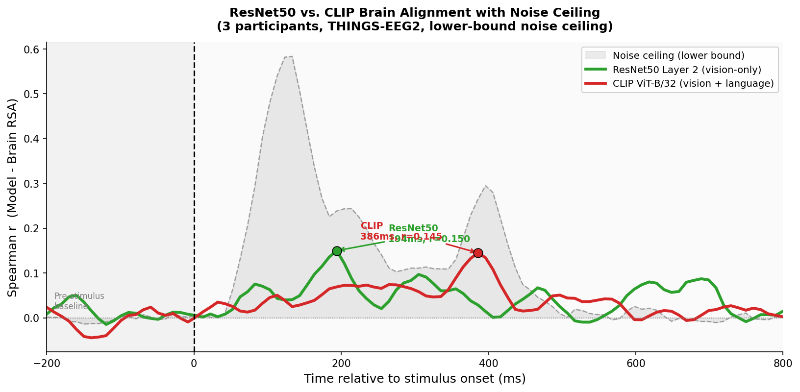

# Time-Resolved RSA: ResNet50 vs. CLIP on THINGS-EEG2

Comparing how well a vision-only model (ResNet50) and a vision-language model (CLIP ViT-B/32) predict human brain responses over time, using Representational Similarity Analysis (RSA) on EEG data from the THINGS-EEG2 dataset.

**ResNet50 Layer 2 peaks at 194ms (r=0.233). CLIP ViT-B/32 peaks later at 386ms (r=0.145).**



---

## What this project does

1. Extracts intermediate layer activations from ResNet50 and CLIP for 200 THINGS object images
2. Computes Representational Dissimilarity Matrices (RDMs) for each model layer and for EEG responses at every timepoint
3. Correlates model RDMs with brain RDMs across time (Spearman r)
4. Identifies which layer best predicts brain activity and when
5. Adds a noise ceiling and permutation-based significance testing

---

## Key result

ResNet50 Layer 2 aligns most strongly with EEG at ~194ms, consistent with the window of peak object-selective activity in ventral visual cortex. CLIP aligns later at ~386ms, suggesting vision-language representations correspond to a later stage of visual processing. Results validated against noise ceiling computed across 3 participants (leave-one-out lower bound).

*Methodology confirmed by the THINGS-EEG2 dataset authors (Gifford et al.).*

---

## Pipeline

| Step | Script | What it does |
|------|--------|--------------|
| 1 | `step1_extract_activations.py` | Extract ResNet50 layer activations for all images |
| 2 | `step2_compute_rdms.py` | Compute RDMs from activations + EEG |
| 3 | `step3_rsa_comparison.py` | Static RSA — which layer best predicts brain? |
| 4 | `step4_time_resolved_rsa.py` | Time-resolved RSA across all ResNet50 layers |
| 5 | `step5_clip_rsa.py` | Extract CLIP features + compare to ResNet50 |
| 6 | `step6_noise_ceiling.py` | Add noise ceiling to final figure |
| 7 | `step7_significance.py` | Permutation test + cluster correction (p<0.05) |

Run scripts in order. Each step saves outputs that the next step reads.

---

## Setup
```bash
pip install torch torchvision open_clip_torch scipy matplotlib tqdm
```

**Python 3.8+ required.**

---

## Data
Uses the **THINGS-EEG2** dataset (Gifford et al., 2022).
Download from: https://osf.io/3jk45/

Place participant folders as:
```
sub-01/preprocessed_eeg_test.npy
sub-02/preprocessed_eeg_test.npy
sub-03/preprocessed_eeg_test.npy
```

Place THINGS test images (one per concept) in:
```
test_images/<concept_name>/<image>.jpg
```

---

## Repo structure
```
├── step1_extract_activations.py
├── step2_compute_rdms.py
├── step3_rsa_comparison.py
├── step4_time_resolved_rsa.py
├── step5_clip_rsa.py
├── step6_noise_ceiling.py
├── step7_significance.py
├── fig/ ← generated figures saved here
├── activations/ ← generated, not committed
├── rdms/ ← generated, not committed
└── README.md
```

---

## Reference
Gifford, A.T., Cichy, R.M. et al. (2022). *A large and rich EEG dataset for modeling human visual object recognition.* NeuroImage. https://doi.org/10.1016/j.neuroimage.2022.119754

---

